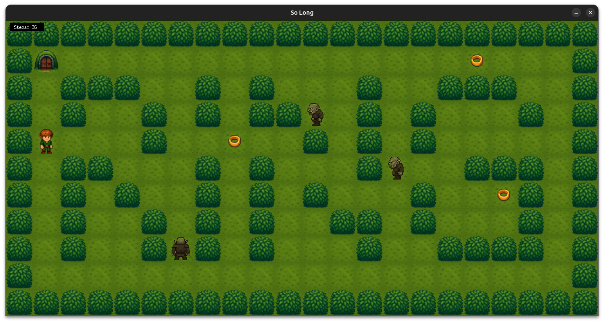
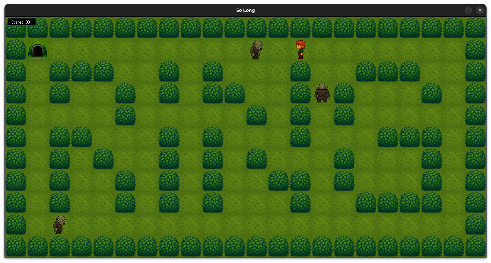

# 🧝‍♂️ so_long: Hobbit Quest — Bonus Edition 💍

A 2D adventure game developed in C using **MiniLibX**, where a hobbit collects magical rings and evades patrolling orcs.

---

## 🎮 Game Concept

Your goal: Collect all enchanted **rings** and escape through the **exit portal**—but beware! Orcs patrol the map and will defeat you if you collide.

Built as part of the 42 curriculum, this project demonstrates your understanding of:
- Graphics rendering (MiniLibX)
- Event-driven input
- Pathfinding logic
- C memory safety and clean exits
- Bonus features: **animations, UI**, and **enemy AI**

---

## ✨ Features

### ✅ Mandatory
- 🗺️ Parses and validates `.ber` map files
- 📏 Ensures map is rectangular, enclosed by walls, and contains required elements
- 🧍 Controlled movement via `W`, `A`, `S`, `D` keys (configurable to `ZQSD`)
- 🚫 Collision detection with walls
- 🎯 Victory only after collecting all rings
- 💬 Movement count printed in terminal
- ❌ Clean exit with ESC key or window close

### 💎 Bonus
- 🔄 **Animated Rings**: Collectibles shimmer across frames (`collectible.frame[]`)
- 👹 **Patrolling Orcs**: Enemies (`X`) move with the player and trigger a loss on contact
- 🧍‍♂️ **Dynamic Sprites**: Player & enemy sprites face the direction of last movement (`sprite` state)
- 🧮 **On-Screen UI**: Movement count rendered in the game window (`draw_move_count`)
- ⚔️ Loss condition handled gracefully when colliding with an enemy

---

## 📂 Project Structure

```makefile
SO_LONG/
├── include/
│   └── so_long.h            # Main header file with all structs and function prototypes
├── libft/                   # Your Libft library (copied in per subject rules)
├── maps/                    # Contains .ber map files
├── mlx/                     # MiniLibX library
├── src/
│   ├── animate.c            # Frame updates and game loop
│   ├── cleanup.c            # Cleanup routines and exit handling
│   ├── controls.c           # Keyboard input handling
│   ├── draw.c               # Drawing map tiles and entities
│   ├── enemy.c              # Orc patrol logic
│   ├── game.c               # Game state setup and loop entry
│   ├── graphics.c           # Image/sprite initialization via MiniLibX
│   ├── main.c               # Program entry point
│   ├── map.c                # Map reading and deallocation
│   ├── ui.c                 # UI elements like move count on-screen
│   ├── validate.c           # Map format validation
│   ├── validate_path.c      # Path validity checking (e.g., flood fill)
├── textures/                # Sprite and tile assets
├── gh-image.png             # Screenshot 1
├── gh-image2.png            # Screenshot 2
├── Makefile                 # Builds the project and handles rules
└── README.md                # You're reading it!
```


## 🛠️ Compilation

To build the project, run:

```bash
make        # builds the game
make clean  # removes object files
make fclean # removes object files and executable
make re     # cleans and rebuilds
```

---

## 🚀 Usage
```bash
./so_long maps/level_02.ber
```

###
📌 The map must follow the required structure using:

- P for player
- C for collectible
- E for exit
- 1 for wall
- 0 for floor
- X (BONUS) for enemies

---

## 🗺️ Map Requirements

- Rectangular
- Surrounded by walls
- One player start (P)
- One exit (E)
- At least one ring (C)
- Valid path must exist from player to all collectibles and then to the exit

---

## 📸 Screenshots

### Game Preview




---

## 👤 Author

Created and maintained by [Martin Justa](https://github.com/aztaban) as part of the 42 school curriculum.
